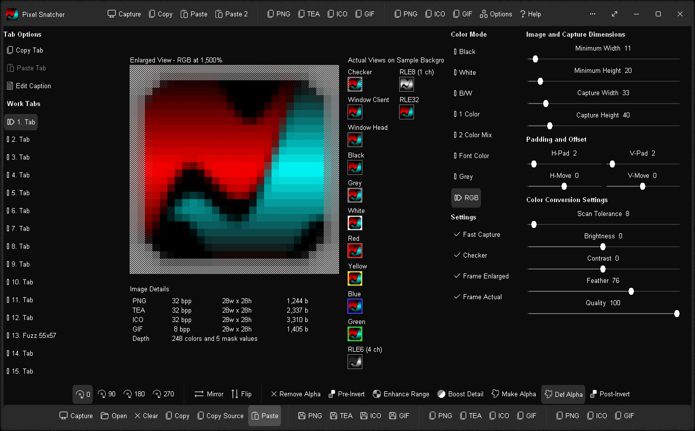
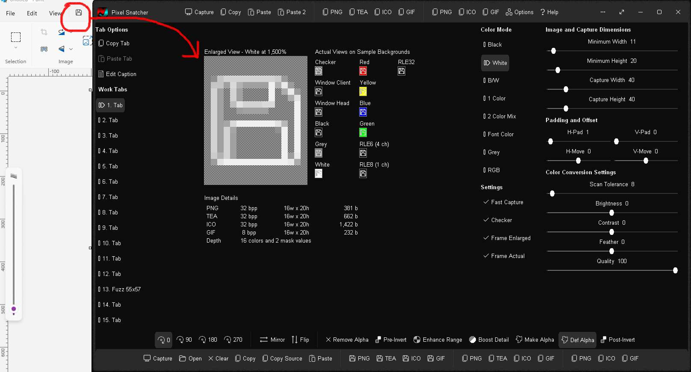
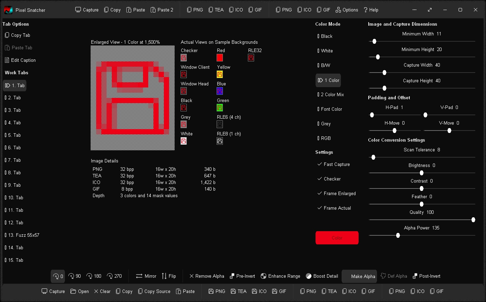
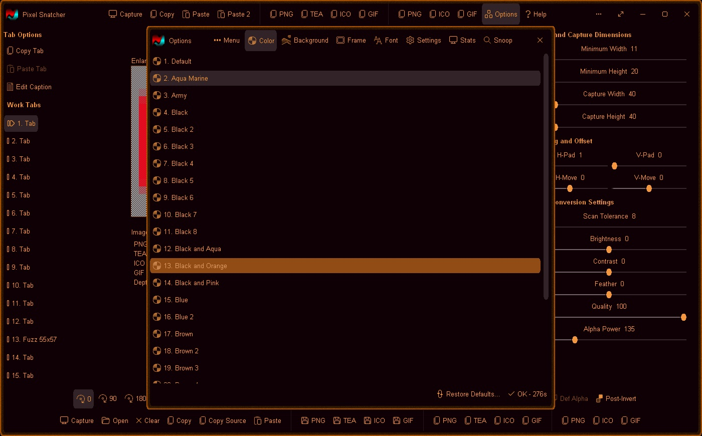

# Pixel Snatcher v1.0.2285 / 16apr2026 / MIT License
Snatch pixels from your screen and convert into translucent tool images in PNG, GIF, ICO and TEA image formats with ease.  Create modern monochromatic tool images in seconds for your app, web app, or Gossamer app.  Click capture, hover mouse cursor over screen area to acquire image, adjust color conversion settings if required, and copy/save. 

# Features
* Generate translucent/transparent images from screen captures (solid image) or paste in an image
* Automatic monochromatic/color conversion, variable background color removal, and smart image cropping
* Color Conversion Modes: Black (shades of black), White (shades of white), B/W (shades of black and white), 1 Color (shades of custom color), 2 Color Mix (shades of two custom colors with Color Mix adjustment), Font Color (shades of current font color), RGBA (original colors)
* Processing Options: Remove Alpha, Pre-Invert, Enhance Range, Boost Detail, Make Alpha, Def. Alpha, and Post-Invert
* Capture image from screen in realtime (2 modes): drag and release (instant), or click and hover (short delay)
* Post-capture adjustment support - click and drag within "Enlarged View" panel area to adjust final capture area and regenerate image
* Custom capture width / height: 5-256px
* Custom minimum image width / height range: 1-256px
* Custom vertical / horizontal transparent padding: 0-30px
* Tweak final vertical / horizontal image position: +/-30px
* Adjust Brightness and Contrast levels
* Twin feather modes: -200..-1: smooth image and feather edges / 1..200: feather edges only / 0: off
* Image Options: Flip, Mirror, and Rotate 0, 90, 180, and 270
* Save image to file as a PNG (32 bit), ICO (32 bit), TEA (32 bit), or GIF (8 bit)
* Copy image to Clipboard as base64 encoded text in mime/type PNG, ICO, or GIF format for pasting directly into html code
* Copy image to Clipboard as a Pascal binary array in PNG, TEA, ICO, or GIF format
* Smart Paste: Accepts a standard image or a Pascal binary array 
* Option: Paste 2 - Paste an image from Clipboard, convert, and copy back to Clipboard as a PNG Pascal binary array with one click for rapid source code work
* Options: Fast Capture, Frame Enlarged, and Frame Actual (outline image boundaries)
* 15 persistent work tabs with customisable caption - each work tab retains its own image and settings
* Copy and Paste image and settings between work tabs via internal Clipboard
* Realtime WYSIWYG (What You See Is What You Get) display
* Options Window - Easily change app color, font, and settings
* Portable
* Smart Source Code (Borland Delphi 3 and Lazarus 2.2/4.4)

# App Changes
* Cleaner, higher-quality RGBA option
* Upgraded feather support for full alpha channel edge feathering
* Paste 2 option
* Simplified operation
* Pre and Post processing options
* Size range extended to 256 px
* RLE 6 (4 color shades), RLE 8 (1 color shade), and RLE 32 (RGBA) preview options for codebase reference work

# Codebase Changes
* Optimised for 2K display (60fps+)
* Functional on 4K display
* General render improvements of ~300%
* Text render improvements of ~200%
* Smart font character caching with twin feather support
* Increased background animation render rate to 60fps
* Active GUI Scaling (60% - 200% of OS scaling, realtime adaptive)
* TextCore (upgraded) - non-GUI and GUI text box engine (txt, bwd, bwp, rtf)
* FastDraw (new) - GUI / general graphics work via high-level and low-level rapid-render procs for the CPU
* Dynamic scaling and loading of System, Folder, and App images
* New color-based animated background schemes / engine upgrade
* Automatic MSIX handling (MS Store app/MSIX bundle) with seamless adaptive settings and temp file storage and management for restrictive access compliance
* Source code supports both 32bit and 64bit
* 32bit compilation in Borland Delphi 3 (stable)
* 32bit compilation in Lazarus 2.2 (stable)
* 64bit compilation in Lazarus 4.4 (functional/work in progress)

# Download
Download <a href="src/pixelsnatcher.exe">pixelsnatcher.exe</a> or from the "<a href="bin/">bin</a>" or "<a href="src/">src</a>" folders above.

# Images

